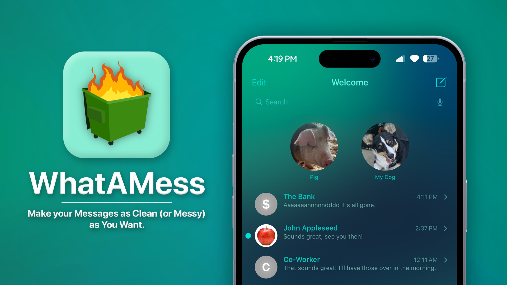
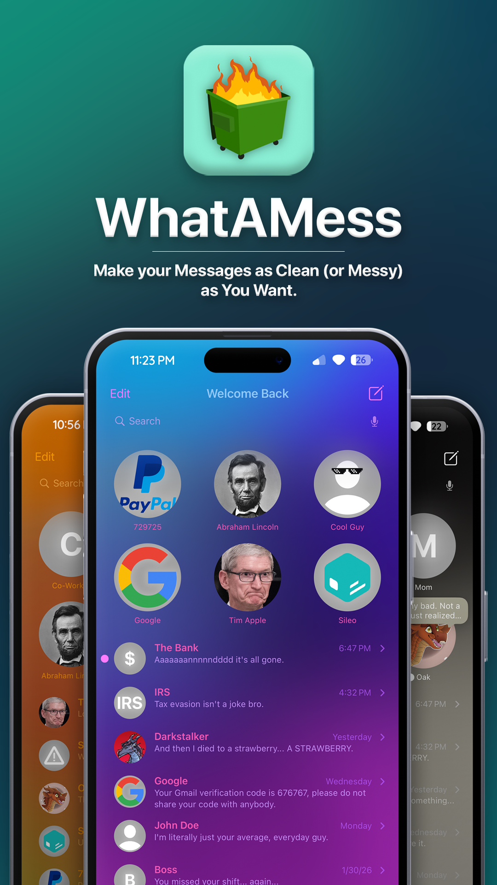
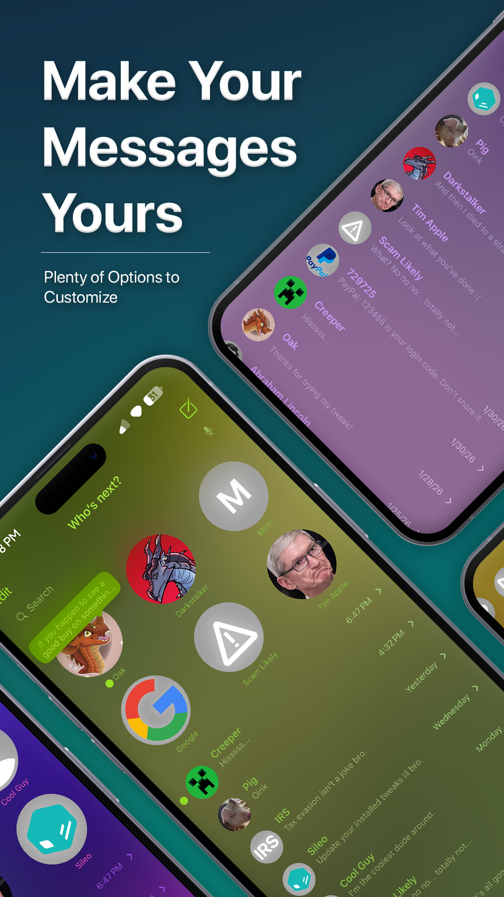
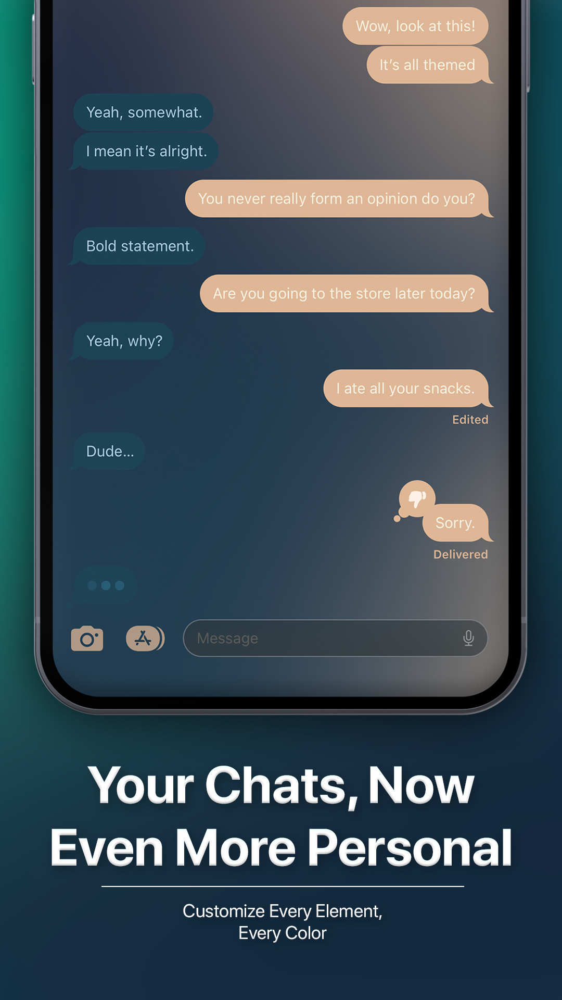
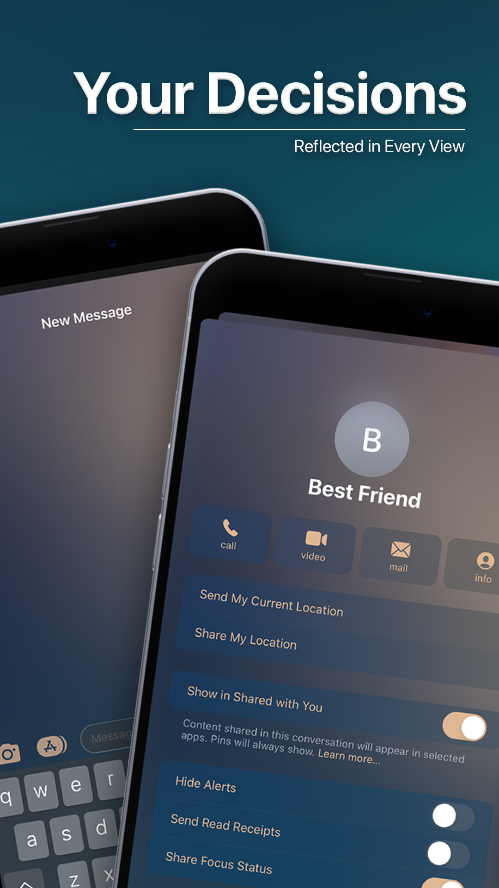
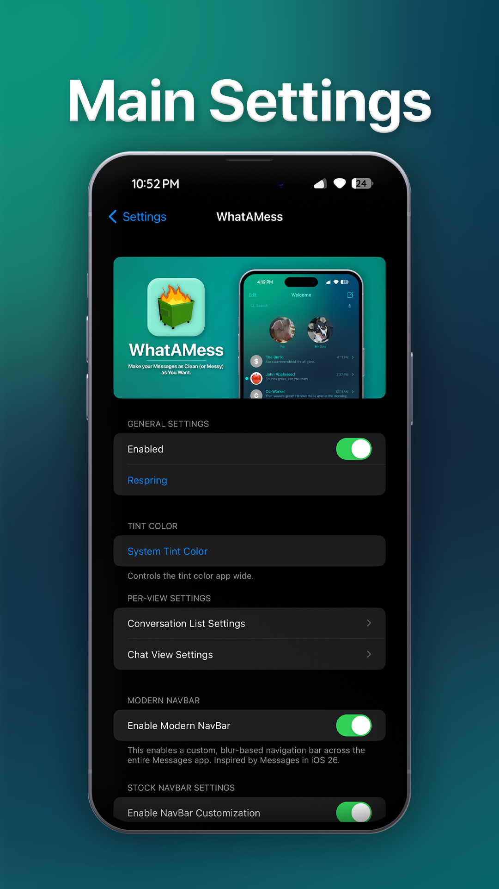
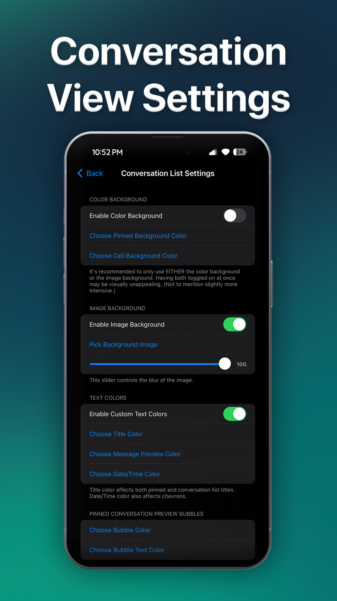
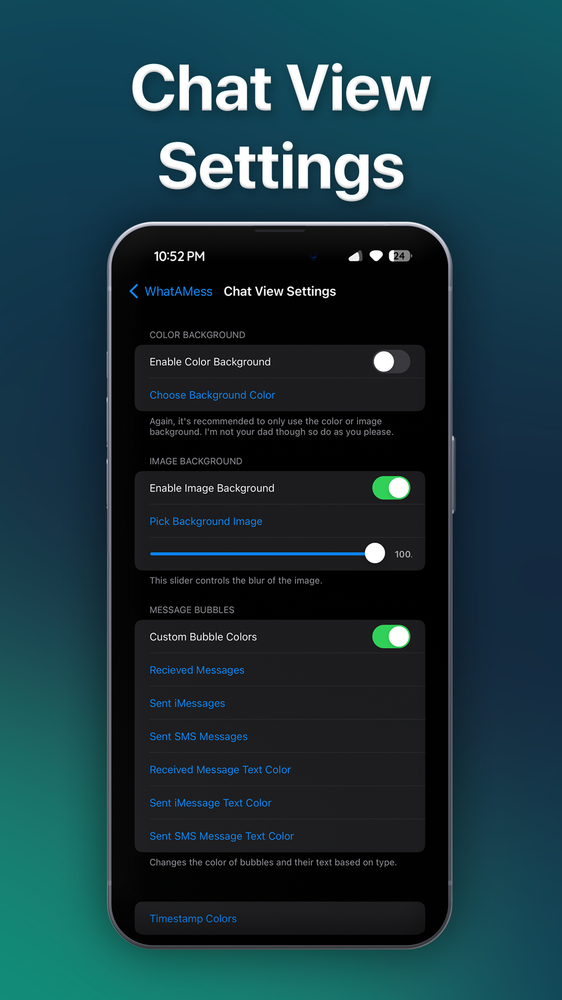

# WhatAMess
**A simple Messages customization tweak for today's jailbreaks.**

_Designed with iOS 16 in mind, supported on iOS 15 and tested on NathanLR on iOS 17._

## Description

For far too long has the Messages app on modern jailbreaks been boring! With WhatAMess, customize (nearly) every color possible across the Messages app. Tailor your app to match your device theme, set your background to what you value most, or just get rid of those green bubbles.

## Features

### General/App-Wide
- Per-Contact Chat Customization
- Change App-Wide Tint Color
- Modern NavBar: A navigation bar that blurs content closer to the top of the screen. (Inspired by Messages on iOS 26. Togglable)
- NavBar Tinting
- Cell Tinting (with optional overrides)
- Dark/Light Mode Customization
- Preset Browsing, Saving, Importing/Exporting

### Conversation List View
- Custom Gradient Background
- Custom Background Image
- Background Image Blur
- Custom Conversation Title, Preview, and Time/Date Color
- Pinned Conversation Preview Bubble + Text Color
- Custom NavBar Title String + Color
- Hide Separators
- Hide Search Background
- Hide Pinned Conversation Glow

### Chat View
- Custom Gradient Background
- Custom Background Image
- Background Image Blur
- Blurred Message Bubbles
- Custom SMS, iMessage, and Recieved Bubble Colors
- Custom SMS, iMessage, and Recieved Bubble Text Colors
- Custom Timestamp Colors
- Modern Message Bar: A similar principle to Modern NavBar. Creates a blur behind the message bar that blurs content closer to the bottom of the screen.
- Message Bar Tint Color
- Message Input Field Background Color
- Message Input Field Background Blur
- Message Input Field Placeholder Text + Text Color
- Send button and arrow coloring
- Input Text Color
- Camera/App Drawer Tint
- Link Bubble Background + Text Color

## Compatability
WhatAMess is compatible with devices running a _rootless_ jailbreak on iOS 15 through iOS 18.

NathanLR 1.0 (non-iOS 17 version) is very questionable. Other semi-jailbreaks and injection methods like Serotonin likely don't work (see below).

Compatability with the following is unknown/uncertain as I don't have the devices to test it but, considering the tweak injects into Messages only, it may be fine. If the tweak works, confirmed, on any of these, _please let me know_:
- Seratonin (According to u/digitalganster, likely doesn't work currently)
- Roothide / Bootstrap (Confirmed working by "Gushi", iOS 16.1)
- Palera1n (Confirmed working by "galaxy note 7", iPhone X iOS 16.7.7)
- Palehide (Confirmed working by "galaxy note 7", iPhone 8+ iOS 16.7.12)
- Palera1n iOS 18.7.2 (Confirmed working by "Yewfie")

## Known Issues
The following are issues I hope to address in future versions in the coming months.
Please keep in mind this is my _first tweak_ and I'm still getting familiar with the process. Things may take time. :)
- Some text such as "2 Replies" may switch back to the system tint color occasionally on iOS 17.
- "Notify Anyway" text shown after sending a message to another user in DND mode may revert back to system color when leaving and reopening window.
- Link Bubbles in Pinned Message Previews sometimes break, displaying a square instead of a bubble.
- Contact "Info" view on iOS 17 is slightly broken.

## Features I'd Like to Add
- Custom Large Title
- Better User Images + Name at Top of Chat View
- Your Suggestions!

## Who Am I Anyways?
Hey! I'm OaksTheAwesome, Oak shorthand. 

First thing's first, I'm no developer by any means. I took some extremely basic python, HTML, and java in highschool, and a singular python class in college. I'm relatively familiar with Java, but Obj-C was only something I stabbed at recently.

Full time college student, part time job, busy life and all the typical things. I primarily focus on my YouTube channel in my creative efforts, that being commentary with a gaming/VR focus. I take on the occasional random project like this when I feel like it. :)

I got interested in jailbreaking back on iOS 11 with my 6th Gen iPod Touch. I've used a jailbroken iDevice almost every day since. After losing my XS on 14.6, I missed the messages customization tweaks of old. So, instead of waiting around for some update or someone to release one, I just attempted to make one myself. Roughly 9 months later and here I am. I hope you enjoy this little thing of mine!

## Questions? Bugs? Feature Requests?
Feel free to reach out to me and check me out at any of the following and I'll try my best to respond! _(I'm not the MOST active on these platforms so bear with me.)_

Here on GitHub! Open an Issue!

Discord: OaksTheAwesome

Twitter: [OaksTheAwesome](https://x.com/OaksTheAwesome)

Email Me: [Email](oaknintendo@gmail.com)

Check me out on YouTube: [YouTube](https://www.youtube.com/@oakstheawesome)

## Screenshots
  
  

